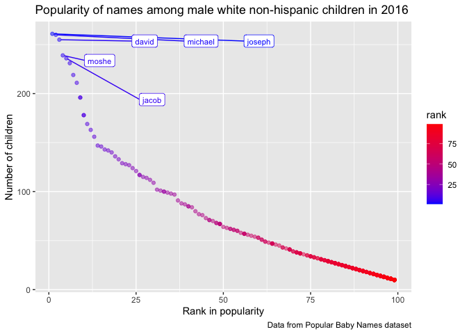

Homework 2
================
jys2137
9/30/2021

The purpose of this file is to present the answers to Homework 2, an
assignment reinforcing ideas in the **Data Wrangling I** topic for
P8105.

## Problem 0.1

This “problem” focuses on structure of my submission, especially the use
git and GitHub for reproducibility, R Projects to organize my work, R
Markdown to write reproducible reports, relative paths to load data from
local files, and reasonable naming structures for my files.

To that end:

-   I created a public GitHub repo + local R Project; we suggest naming
    this repo / directory p8105\_hw2\_jys2137
-   I created a single .Rmd file named p8105\_hw2\_jys2137.Rmd that
    renders to github\_document
-   I created a subdirectory to store the local data files used in this
    assignment, and used relative paths to access these data files
-   I submitted a link to my repo via Courseworks
-   I aimed to adhere to appropriate styling and clarity of code in
    Problems 1+.

## Problem 1

### Cleaning the *Mr. Trash Wheel* sheet

The code chunk below is used to:

-   **clean** the `Mr. Trash Wheel` sheet by:
    -   omitting non-data entries (rows with notes / figures; columns
        containing notes)
    -   using reasonable variable names (clean names)
    -   omitting rows that do not include `dumpster`-specific data
-   **round** `sports_balls` to the nearest integer

``` r
mr_trash_wheel_sheet = 
  read_excel("./data/Trash-Wheel-Collection-Totals-7-2020-2.xlsx",
    sheet = "Mr. Trash Wheel", skip = 1) %>%
  janitor::clean_names() %>%
  select(dumpster:homes_powered) %>%
  drop_na(dumpster) %>%
  mutate(sports_balls = round(sports_balls, digits = 0))
```

### Cleaning precipitation data for 2018 and 2019

The code chunk below **cleans** the precipitation data for 2018 and 2019
by:

-   omitting rows without precipitation data
-   adding a variable for year

``` r
precip_2018 = 
  read_excel("./data/Trash-Wheel-Collection-Totals-7-2020-2.xlsx",
    sheet = "2018 Precipitation", skip = 1) %>%
  janitor::clean_names() %>%
  drop_na(month) %>%
  mutate(year = 2018)

precip_2019 = 
  read_excel("./data/Trash-Wheel-Collection-Totals-7-2020-2.xlsx",
    sheet = "2019 Precipitation", skip = 1) %>%
  janitor::clean_names() %>%
  drop_na(month, total) %>%
  mutate(year = 2019)
```

#### Combining precipitation datasets

Next, we **combine** the precipitation datasets and **convert month** to
a character variable.

``` r
precip_comb_data = 
  bind_rows(precip_2018, precip_2019) %>% 
  mutate(
    month = month.name[as.numeric(month)], 
    month = str_to_lower(month))
```

### Description of the data

##### For the *Mr. Trash Wheel* data

The *Mr. Trash Wheel* dataset includes **454** observations, taking
**14** variables into account. These 14 variables include information on
each `dumpster` (including number, weight, and volume) and the amount of
each litter type (including `plastic_bottles`, `polystyrene`,
`cigarette_butts`, `glass_bottles`, `grocery_bags`, `chip_bags`, and
`sports_balls`). The median number of sports balls in a dumpster in 2017
was **8**.

##### For the *precipitation* data

The precipitation data includes **24** observations, taking **3**
variables into account. These **3** variables include `month`, `total`
precipitation in inches, and `year`. For available data, the total
precipitation in 2018 was **70.33 in**.

## Problem 2

### Cleaning the *FiveThirtyEight* datasets

This problem uses the *FiveThirtyEight* datasets:`pols-month.csv`,
`snp.csv`, and `unemployment.csv`. The following includes steps to clean
and merge these into a single data frame using year and month as keys.

##### First, we clean `pols-month.csv`

We clean the data by:

-   breaking up `mon` into integer variables `year`, `month`, and `day`
-   replacing month number with month name
-   creating `president` from values *gop* and *dem*
-   removing `prez_dem`, `prez_gop`, and `day`

``` r
pols_df = 
  read_csv("./data/fivethirtyeight_datasets/pols-month.csv") %>%
  separate("mon", into = c("year", "month", "day")) %>% 
  mutate(
    month = month.name[as.numeric(month)], 
    month = str_to_lower(month),
    president = recode(prez_gop, "0" = "dem", "1" = "gop", "2" = "gop")) %>% 
 select(-starts_with("prez"), -day)
```

##### Second, we clean `snp.csv`

For consistency across datasets, we arrange according to `year` and
`month`, and organize so that `year` and `month` are the leading
columns.

``` r
snp_df = 
  read_csv("./data/fivethirtyeight_datasets/snp.csv") %>%
  separate("date", into = c("month", "day", "year"), convert = TRUE) %>% 
  mutate(
    year, year = if_else(year <= 15, year + 2000, year + 1900)) %>% 
  arrange(year, month) %>% 
  mutate(
    month = month.name[as.numeric(month)], 
    month = str_to_lower(month),
    year = as.character(year)) %>% 
  select(year, month, close, -day)
```

##### Third, we clean `unemployment.csv`

Here, we tidy the unemployment data so that it can be merged with the
previous datasets. This involves:

-   switching from “wide” to “long” format
-   ensuring that key variables have the same name
-   ensuring that key variables take the same values

``` r
unemploy_df = 
  read.csv("./data/fivethirtyeight_datasets/unemployment.csv") %>% 
  janitor::clean_names() %>%
  pivot_longer(
    jan:dec,
    names_to = "month", 
    values_to = "unemployment") %>% 
  mutate(
      year = as.character(year),
      month = recode(month,
              jan = "january", feb = "february", mar = "march", apr = "april",
              may = "may", jun = "june", jul = "july", aug = "august",
              sep = "september", oct = "october", nov = "november", dec = "december"))
```

##### Lastly, we join the datasets

We join the datasets by merging snp into pols, and merging unemployment
into the result.

``` r
pols_snp_data =
  left_join(pols_df, snp_df)

fte_join_data =
  left_join(pols_snp_data, unemploy_df)
```

### Description of the *FiveThirtyEight* datasets

The `pols_df` data includes **822** observations and **9** variables,
related to the number of politicians who are democratic (`dem`) or
republican (`gop`) at any given time between 1947 and 2015.

The `snp_df` data includes **787** observations and **3** variables,
related to Standard & Poor’s stock market index (S&P) from 1950 to 2015.
This included the `year`, `month`, and associated `close` values of the
S&P.

The `unemploy_df` data includes **816** observations and **3** variables
percentage of unemployment in each month (`january` through `december`)
of the associated year from 1948 and 2015.

The resulting dataset (with `pols_df`,`snp_df`, and `unemploy_df`
combined) of **822** observations and **11** variables shows that
between 1947 and 2015, when a republican was `president`, the
unemployment rate was **5.93%** and S&P was **378.27** On the other
hand, when a democrat was `president`, the `unemployment` rate was
**5.71%** and the S%P was **588.26**

This dataset also has information on the `month` specific `unemployment`
rates for each `year` and on the number of governors, senators, and
representatives who were either democrats or republicans for each
`month`.

## Problem 3

\*\*\*Load and tidy the data. Note that, although these data may seem
fairly well formatted initially, the names of a categorical predictor
and the case structure of string variables changed over time; you’ll
need to address this in your data cleaning. Also, some rows seem
duplicated, and these will need to be removed (hint: google something
like “dplyr remove duplicate rows” to get started).

### Cleaning the *Popular Baby Names* data

Here, we are using data from NYC Open data on the popularity of baby
names. First, we tidy the data as shown in the code chunk below.

``` r
baby_names_df = 
  read_csv("./data/Popular_Baby_Names.csv") %>% 
  janitor::clean_names() %>% 
  mutate(
    ethnicity = str_to_lower(ethnicity),
    childs_first_name = str_to_lower(childs_first_name),
    gender = str_to_lower(gender),
    ethnicity = recode(ethnicity, 
                       "asian and paci" = "asian and pacific islander", 
                       "black non hisp" = "black non hispanic",
                       "white non hisp" = "white non hispanic")) %>% 
  distinct()
```

### Creating a table: rank in popularity of *“Olivia”* as a female baby name

Now, we produce a table showing the rank in popularity of the name
“Olivia” as a female baby name over time. In this table: *ethnicities
are in rows* and *years are in columns*.

``` r
olivia_table = 
  baby_names_df %>%
  filter(childs_first_name == "olivia") %>% 
  select(-gender, -childs_first_name, -count) %>% 
  pivot_wider(names_from = year_of_birth, values_from = rank)

kable(olivia_table)
```

| ethnicity                  | 2016 | 2015 | 2014 | 2013 | 2012 | 2011 |
|:---------------------------|-----:|-----:|-----:|-----:|-----:|-----:|
| asian and pacific islander |    1 |    1 |    1 |    3 |    3 |    4 |
| black non hispanic         |    8 |    4 |    8 |    6 |    8 |   10 |
| hispanic                   |   13 |   16 |   16 |   22 |   22 |   18 |
| white non hispanic         |    1 |    1 |    1 |    1 |    4 |    2 |

### Creating a table: most popular name among male children

Here, we produce a similar table as the one above, that shows the most
popular name among male children over time. In this table: *ethnicities
are in rows* and *years are in columns*.

``` r
male_names_table = 
  baby_names_df %>%
  filter(rank == "1", gender == "male") %>% 
  select(-gender, -count, -rank) %>% 
  pivot_wider(names_from = year_of_birth, values_from = childs_first_name)

kable(male_names_table)
```

| ethnicity                  | 2016   | 2015   | 2014   | 2013   | 2012   | 2011    |
|:---------------------------|:-------|:-------|:-------|:-------|:-------|:--------|
| asian and pacific islander | ethan  | jayden | jayden | jayden | ryan   | ethan   |
| black non hispanic         | noah   | noah   | ethan  | ethan  | jayden | jayden  |
| hispanic                   | liam   | liam   | liam   | jayden | jayden | jayden  |
| white non hispanic         | joseph | david  | joseph | david  | joseph | michael |

### Creating a scatter plot: rank of male white non-hispanic children names in 2016

Finally, we create a **scatter plot** for *male, white non-hispanic
children born in 2016*. The number of children with a name (y axis) is
against the rank in popularity of that name (x axis).

``` r
male_nhw_2016 = 
  baby_names_df %>% 
  filter(gender == "male", ethnicity == "white non hispanic", year_of_birth == 2016)

ggplot(male_nhw_2016, aes(x = rank, y = count, color = rank)) + 
  geom_point(alpha = .5) +
  scale_color_gradient(low = "blue", high = "red") +
  labs(
    title = "Popularity of names among male white non-hispanic children in 2016",
    x = "Rank in popularity",
    y = "Number of children",
    caption = "Data from Popular Baby Names dataset")
```

<!-- -->

``` r
ggsave("male_nhw_2016.pdf", height = 4, width = 6)
```

``` r
male_nhw_2016_draft = 
  baby_names_df %>% 
  filter(gender == "male", ethnicity == "white non hispanic", year_of_birth == 2016)

library(ggrepel)

newtable = ggplot(male_nhw_2016_draft, aes(x = rank, y = count, color = rank)) + 
  geom_point(alpha = .5) +
  labs(
    title = "Popularity of names among male white non-hispanic children in 2016",
    x = "Rank in popularity",
    y = "Number of children",
    caption = "Data from Popular Baby Names dataset") +
  theme(legend.position = "none") +
  geom_label_repel(aes(label = ifelse(rank <= 5, as.character(childs_first_name),'')),
                   size = 3,
                   box.padding = 1,
                   point.padding = .1) +
  scale_color_gradient(low = "blue", high = "red")
newtable
```

<!-- -->
